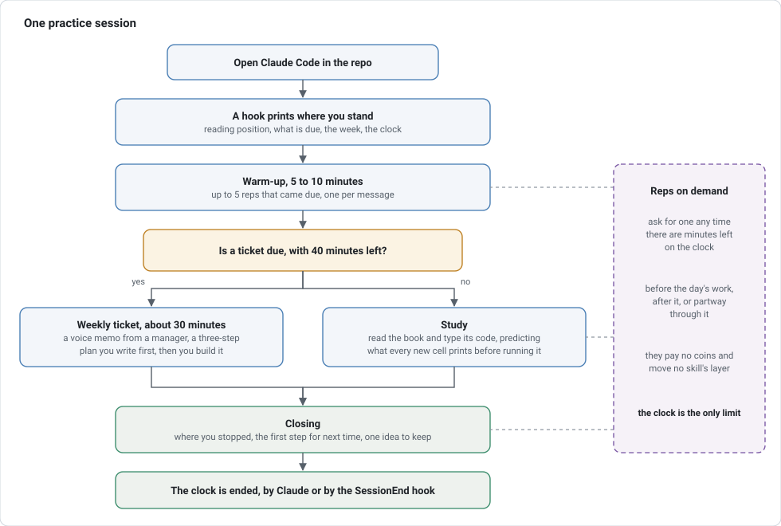
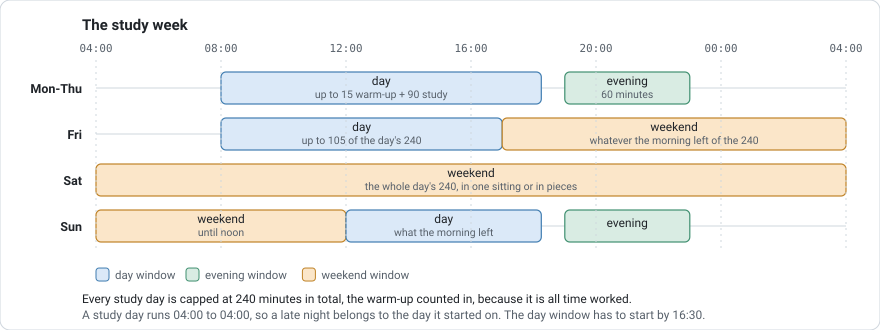

# Data-Analysis-4th-Edition
My Analysis and ML journey using Avinash Navlani and Cornellius Yudha ijaya's book. 

## Setup on a new machine

This repo works the same on Windows, macOS, and Linux. Set it up with Claude Code, or by hand.

### With Claude Code

| Step | Do this | What it does |
|---|---|---|
| 1 | Install [Git](https://git-scm.com/downloads) and [Claude Code](https://code.claude.com/docs/en/setup). | Git copies the repo to this computer, and Claude Code runs the setup. |
| 2 | `git clone https://github.com/ChandlerM2/Data-Analysis-4th-Edition.git` | Downloads the repo into a `Data-Analysis-4th-Edition` folder. |
| 3 | `cd Data-Analysis-4th-Edition`, then `claude` | Starts Claude Code inside the repo folder. |
| 4 | Say **"set me up"**, or run `/setup`. | Claude runs the setup skill in `.claude/skills/setup/`. It checks the computer, fixes what it can ([uv](https://docs.astral.sh/uv/), Python, packages, the Git author email, VS Code extensions, and the writing guide in `~/.claude/rules/`), asks before deleting anything, and lists what's left for you, like adding the book PDF. |

Running the skill again on a computer that's already set up changes nothing, so it's also the
way to update an older clone.

### By hand

| Step | Do this | What it does |
|---|---|---|
| 1 | Install [uv](https://docs.astral.sh/uv/) and clone the repo. | uv installs Python and the project's packages. |
| 2 | `uv sync`, from the repo root | Reads `uv.lock`, installs the pinned Python if it's missing, and builds `.venv` with the exact package versions recorded there. |
| 3 | `git config --global user.email "<your no-reply address>"` | Commits carry your GitHub no-reply address, listed on GitHub's Emails settings page, so your personal email stays out of public commits. |
| 4 | In VS Code, install the Python, Jupyter, and ty extensions, open a notebook, and pick the `.venv` kernel. | Notebooks run in the project environment. To use JupyterLab instead, run `uv run jupyter lab`. |
| 5 | Optional: add the book PDF (see `book/README.md`), and copy `.claude/skills/setup/files/writing-for-future-readers.md` into `~/.claude/rules/`. | The PDF lets practice reps draw on the book's own pages, and the writing guide shapes how Claude writes docs and code comments on this computer. |

To check a setup at any time, run
`uv run --no-project python .claude/skills/setup/scripts/check_setup.py`.

## PRACTICE: the teaching harness

Reading a chapter builds understanding, but not the ability to do the work. `PRACTICE/` holds a
harness that Claude Code runs every session so practice happens without planning it.

- **Warm-up (5 to 10 minutes).** The day's first session opens with a few small reps, one at a
  time: predict what a cell prints, pick the right function for a job, find a bug, reorder
  shuffled lines, or break a request into steps. Answers are a letter, a line, or a short cell.
  The warm-up belongs to the study day, so opening Claude Code again later does not repeat it.
- **Study.** Read and type the book's code. Before running a new cell, predict what it prints.
  When an idea takes a while to click, Claude works it with a worked example and a puzzle.
  When you stop, Claude records where, the first step for next time, and the one idea you'd most
  regret forgetting.
- **Weekly ticket (about 30 minutes).** A manager at a made-up company sends a voice memo with a
  job request that mixes several ideas. Plan it in three steps, then build it with docs open.
- **Reps on demand.** Ask for reps on anything, any time there are minutes left on the clock,
  before the day's work or after it. The clock is the only limit. A rep on a skill that is not
  due pays nothing and does not move its layer.

### The session



### The week



The day window has to start by 16:30, because it is the long reading block and a stub session
cannot hold it. The weekend has no last start: noon on Sunday cuts a late start short on its own.
A hook checks the clock on every message, Claude starts wrapping up 15 minutes before time runs
out, and a `SessionEnd` hook closes the clock when you quit. `PRACTICE/time.csv` records the
minutes. The windows and budgets live in `PRACTICE/settings.json`, where `"enabled": false` under
`clock` turns the limits off and `true` turns them back on.

### The whole process, from the tool itself

Run `uv run --no-project python PRACTICE/tools/harness.py guide` for this, with the numbers read
from `settings.json` so it cannot drift from what the tools actually do. Add `--help` to
`harness.py` or `clock.py` for the full list of commands.

```text
HOW PRACTICE WORKS

THE LOOP
  1. Open Claude Code in this repo. A hook prints where you stopped reading, what is due, how the
     week looks, and where the clock stands. Claude opens with the first warm-up rep, or with the
     planned first step when today's warm-up is already done.
  2. Warm-up, 5 to 10 minutes: up to 5 reps on skills that came due today, one per message. It
     belongs to the study day, not the session, so it happens once however many times you open.
  3. Study, or the weekly ticket. Study is reading the book and typing its code, predicting what
     each new cell prints before you run it. A ticket is a job request from a manager at Cobalt
     Trail Outfitters that you plan in three steps, then build with the docs open.
  4. Reps on demand, any time there are minutes left. Ask and Claude runs reps on anything you
     name, before the day's work, after it, or partway through; the clock is the only limit. A rep
     on a skill that is not due pays nothing and does not move its layer, because recall builds
     after a night's sleep, not an hour after a miss.
  5. Closing: where you stopped reading, the first step for next time, the one idea from today
     worth keeping, and the clock is ended.

THE CLOCK (settings.json)
  day      08:00 to 18:15, start by 16:30  up to 15 of warm-up, then 90 of study
  closed   18:15 to 19:00                  logistics only: no reps, no new material
  evening  19:00 to 23:00                  60 minutes in total
  weekend  Fri 17:00 to Sun 12:00          one window, no warm-up split, no last start
  Minutes come from the marks your messages leave. A session you close counts in full, gaps and all;
  one you walk away from counts to your last message. After 20 quiet minutes Claude checks in. After
  30 the session is over: the clock closes it back at that message and practice locks, so
  nothing more is recorded until you quit and start a new session. Reading the log still works.
  Studying away from the chat is added back with `clock.py charge --minutes N`, so say so when you
  have been reading.
  Over all of them: 240 minutes a study day, the warm-up counted with them, because it
  is all time worked. A study day runs 04:00 to 04:00, so a late night belongs to the day it
  started on. A closing time always outranks a budget, so what is left is the smaller of the two.

THE LAYERS: how much help a skill still gets
  1    you type a worked example and predict its output, in the chat
  2    parsons or fill: you reorder shuffled lines or type the missing one, in a session notebook
  3    you do the rep; Claude asks guiding questions and answers only on the second ask
  4-7  you do the rep alone, in a different format or setting each time
  A skill moves up when you get it without help and back down when you do not, and its next rep is
  scheduled further out each time it holds.

REP FORMATS
  worked, parsons, fill, predict, tool-pick, bug-hunt, contrast, modify, decompose, explain, ticket

MONEY (real dollars, quoted only at the warm-up summary)
  warmup start $1.00   scheduled rep $1.00   clean bonus $2.00   study catch $4.00   fix $1.00   section $1.00   ticket $20.00   regained layer $1.00
  A rep below the best layer a skill has reached pays $0.25 instead of the rates
  above. Winning that best layer back pays the full rate and $1.00 on top,
  because that is the skill being mastered. The evening window pays double.
  No daily cap and no monthly budget: the clock is the only limit. Tell Claude what you spent the
  money on and it records that against the balance.

WHERE THINGS LIVE
  ChapterN - Topic/   your notebooks and chapterN.md, your notes in your own words
  PRACTICE/log.jsonl  every skill, rep, tip, and reward event: the only record, replayed each run
  PRACTICE/time.csv   one row per clock event, which is where the minutes come from
  PRACTICE/sessions/  practice notebooks Claude builds for layer 2 and up
  PRACTICE/CLAUDE.md  the rules Claude follows to run all of this

COMMANDS
  uv run --no-project python PRACTICE/tools/harness.py <command>   (status, due, skills, guide, ...)
  uv run --no-project python PRACTICE/tools/clock.py <command>     (status, start, end, charge, report)
  Add --help to either for the full list. Claude runs these; you never have to.
```

Each tracked idea (a skill) climbs seven layers. Help fades from a worked example to working alone,
and the wait before the next rep grows from a day to a month. A wrong answer drops it back a layer
so help returns. Showing up, practicing what's due, finishing a section and fixing mistakes pay
real dollars, doubled in the evening window, with no cap but the clock.

Say **"warm up"** to start, **"done"** to close a study session, **"dispute 3"** to have a graded
rep rechecked, and **"I already know this one"** to test out of a skill. The rules Claude follows
are in `PRACTICE/CLAUDE.md`. `PRACTICE/log.jsonl` is the record, written only by
`PRACTICE/tools/harness.py`, and `PRACTICE/tips.md` collects the rules of thumb from past sessions.
After changing a tool, run `uv run --no-project python PRACTICE/tools/tests/run.py`.
